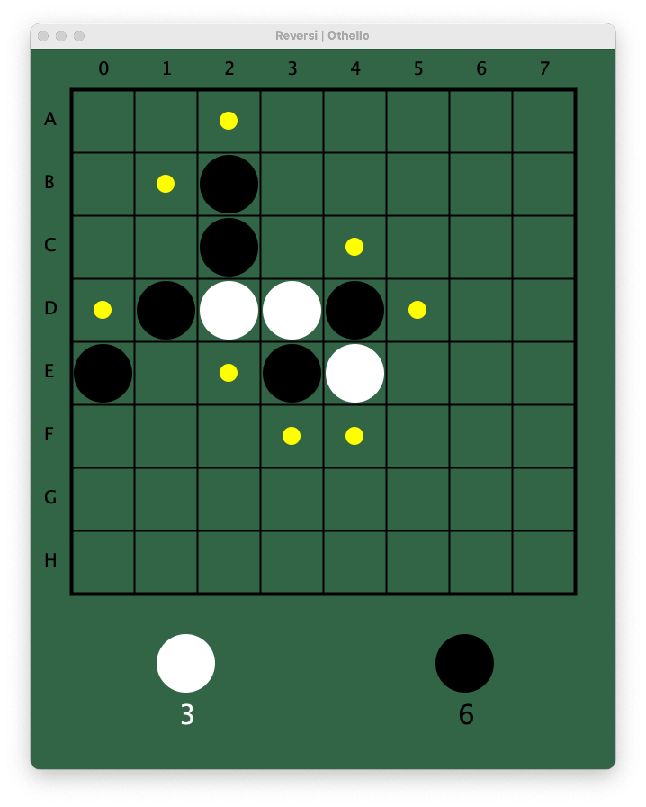

# Reversi Game with Graphics in Scala

## Introduction
This is a school project for HEVS Sion. It is a Scala implementation of the classic board game Reversi, also known as Othello. It's a strategy game for two players, played on an 8x8 board with graphics.

## Features
- Graphical gameplay.
- Support for two-player mode.
- Dynamic updates of the game board and scores.

## Requirements
- Java JDK 11 or higher.
- Scala 2.13.

## Installation and Running the Game
To run this game with its graphical interface:
1. Clone the repository: `git clone [URL]`
2. Navigate to the repository directory: `cd reversi-game`
3. Compile and run the game: `scalac Reversi.scala && scala Reversi`

## How to Play
- Players take turns placing coins on the board.
- Chose where you wanna place the coin by indicating its coordinates.
- The valid coordinates are recognisable by a yellow dot.
    - A move is valid if it traps a coin of the oposite player
- The game continues until one players wins.

## Code Structure
- `Reversi`: The main class that initializes the game and handles the graphics.
- `Coin`: Represents the coins on the board.
- `GameManager`: Manages the game logic and player turns.
- ...

## Screenshots

